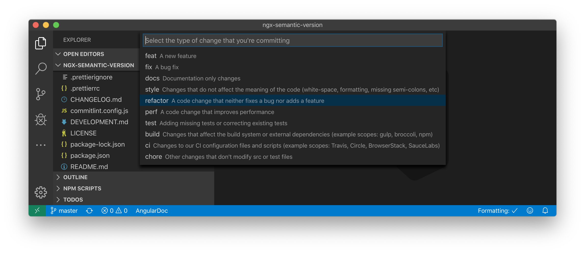

# ngx-semantic-version

[](https://www.npmjs.com/package/ngx-semantic-version)
[](https://www.npmjs.com/package/ngx-semantic-version)
[](http://makeapullrequest.com)
[](https://github.com/ellerbrock/open-source-badge/)
[](http://commitizen.github.io/cz-cli/)

[](https://www.npmjs.com/package/ngx-semantic-version)
[](https://www.npmjs.com/package/ngx-semantic-version)
[](https://www.npmjs.com/package/ngx-semantic-version)
[](https://www.npmjs.com/package/ngx-semantic-version)

This angular-cli schematic, will let you use unified commit messages and let's you release new versions (bumping up the correct version part by analyzing your git history).
It will help you to keep your `CHNAGELOG.md` up to date and release new tagged versions.

The schematic will configure the following packages / services:

- [commitlint](https://commitlint.js.org)
- [husky](https://www.npmjs.com/package/husky)
- [commitizen](https://www.npmjs.com/package/commitizen)
- [standard-version](https://www.npmjs.com/package/standard-version)

## How to use

### Add the schematics to your project

Just run the following command:

```sh
ng add ngx-semantic-version
```

#### available options

| Flag             | Description                                                        |
| ---------------- | ------------------------------------------------------------------ |
| `--skip-install` | Skips installing new `node_modules` after modifying `package.json` |

### Update the schematics

An update schematic is not implemented jet.

## What's included

### [commitlint](https://commitlint.js.org)

Commitlint will lint your commit massage and check it against some common rules.
It will throw an error if the messages doesn't match with the rules.
This schematic will install the ruleset [`@commitlint/config-conventional`](https://npmjs.com/package/@commitlint/config-conventional) by default.

After adding the schematics you will be able to adjust the rules for your
personal needs by adjusting the added file `commitlint.config.js`.

You can find a description of supported adjustments in the
[official documentation](https://commitlint.js.org/#/reference-rules).


### [husky](https://www.npmjs.com/package/husky)

Husky allows you to hook into the git lifecycle. It is used to check commit
messages before storing them by using `commitlint`. As well as calling `commitizen` for interactive commit message generation.

### [commitizen](https://www.npmjs.com/package/commitizen)

When having restrichtions within the commit message text it can be struggeling
to satisfy always the appropriate format. Commitizen will help you to build a
commit message always in the appropriate format by letting you configure the
final message via an interactive cli.


> Tip: if you are using vscode, you can add the plugin [Visual Studio Code Commitizen Support](https://marketplace.visualstudio.com/items?itemName=KnisterPeter.vscode-commitizen) which will let you build the commit message directly via vscode.
> 

### [standard-version](https://www.npmjs.com/package/standard-version)

Standard-version will create and update your app/package version and automatically
generate a `CHANGELOG.md` file and keep it up-to-date by using the git history.
It will check the messages for keywords (thanks to commitlint) and determine which part
of the semantic version will be increased. Furthermore it will add a tag for the version.

After adding this schematic, you can simply release a new version by running `npm run release`.
This will keep your `CHNAGELOG.md` up to date and releases a new version of your project.

#### release first version

To release the first version of you project simply run `npm run release -- --first-release`

#### release regular version

Just run `npm run release -- --first-release`

#### release a pre-release

`npm run release -- --prerelease` or `npm run release -- --prerelease alpha`, etc.
For more options check out the [official doc](https://www.npmjs.com/package/standard-version#release-as-a-pre-release)

## Development

For development hints, have a look at [DEVELOPMENT.md](./DEVELOPMENT.md)
